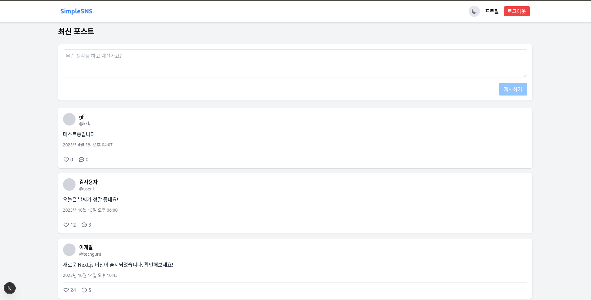
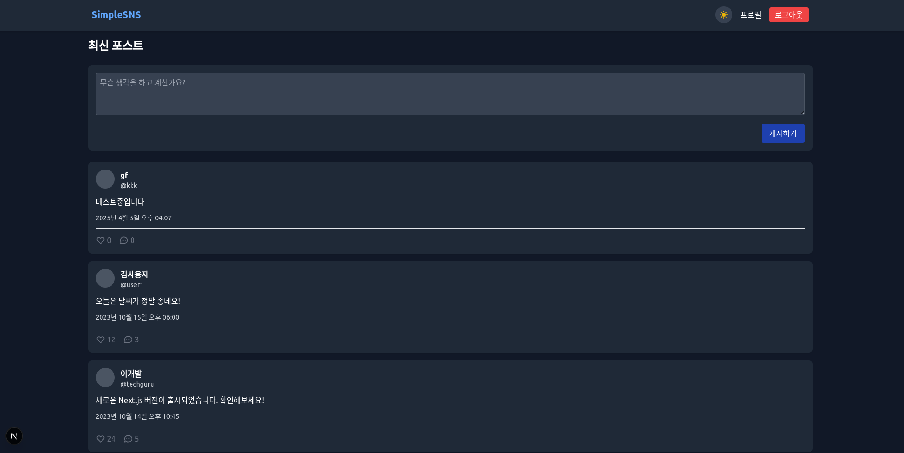

# Next.js SNS 애플리케이션

이 프로젝트는 Next.js를 사용하여 만든 간단한 소셜 네트워크 서비스(SNS) 애플리케이션입니다.

### White mode
 

### Dark mode
 

## 주요 기능

- 사용자 인증 (로그인/회원가입)
- 포스트 작성 및 조회
- 댓글 기능
- 좋아요 기능
- 사용자 프로필 페이지
- 다크 모드 지원

## 기술 스택

- **Frontend**: Next.js, React
- **스타일링**: TailwindCSS
- **상태 관리**: React Hooks (useState, useEffect)
- **라우팅**: Next.js 라우터

## 시작하기

### 사전 요구사항

- Node.js (v14 이상)
- npm 또는 yarn

### 설치 방법

1. 의존성 설치:
```bash
npm install
# 또는
yarn install
```

2. 개발 서버 실행:
```bash
npm run dev
# 또는
yarn dev
```

3. 브라우저에서 `http://localhost:3000`으로 접속하여 애플리케이션 확인

## 프로젝트 구조

```
my-sns-app/
├── components/             # 재사용 가능한 UI 컴포넌트
│   ├── CommentSection.js   # 댓글 섹션 컴포넌트
│   ├── Layout.js           # 전체 레이아웃 컴포넌트
│   ├── Navbar.js           # 네비게이션 바 컴포넌트
│   ├── PostCard.js         # 포스트 카드 컴포넌트
│   └── PostForm.js         # 포스트 작성 폼 컴포넌트
│
├── lib/                    # 유틸리티 함수 및 API 관련 코드
│   ├── ThemeContext.js     # 다크 모드 컨텍스트
│   ├── auth.js             # 인증 관련 함수
│   └── db.js               # 데이터 관련 함수 (더미 데이터 포함)
│
├── pages/                  # 페이지 컴포넌트 및 라우팅
│   ├── _app.js             # 앱 전체 설정 및 레이아웃
│   ├── index.js            # 홈페이지 (포스트 피드)
│   ├── login.js            # 로그인 페이지
│   ├── register.js         # 회원가입 페이지
│   ├── profile/[username].js  # 사용자 프로필 페이지
│   └── post/[id].js        # 포스트 상세 페이지
│
├── public/                 # 정적 파일
│
├── styles/                 # 스타일시트
│   └── globals.css         # 전역 CSS 스타일
│
├── .gitignore              # Git 제외 파일 목록
├── next.config.js          # Next.js 설정
├── package.json            # 프로젝트 의존성 및 스크립트
├── postcss.config.js       # PostCSS 설정
├── README.md               # 프로젝트 문서
└── tailwind.config.js      # TailwindCSS 설정
```

## 테스트 계정

애플리케이션 테스트를 위한 더미 계정:

```
아이디: user
비밀번호: password
```

## 개발 참고 사항

- 현재 구현은 클라이언트 측 로컬 스토리지를 사용하며 실제 백엔드는 연결되어 있지 않습니다.
- 실제 서비스로 확장하려면 데이터베이스 연결 및 API 엔드포인트 구현이 필요합니다.
- 다크 모드는 로컬 스토리지에 설정이 저장되어 브라우저를 새로고침해도 유지됩니다.

## 향후 개선 사항

- 실제 백엔드 API 연동
- 이미지 업로드 기능
- 알림 시스템
- 검색 기능
- 모바일 앱 최적화

## 라이선스

MIT

---

이 프로젝트는 교육 목적으로 제작되었으며, Next.js와 React를 학습하는 데 도움이 됩니다.
